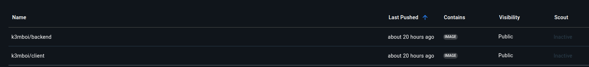

## Docker File Explanation

### Choice of Base image
- Used `node:24-alpine3.21` as the main base image for both Dockerfile 

### Dockerfile directives

#### client

-`FROM node:16.17.1-alpine3.16` - is the base image for the image

- `RUN mkdir /client` - creates a directory for the client application

- `WORKDIR /client` - changes the working directory to the one created.

-`COPY package.json package-lock.json ./` - copies the file dependencies into the working directory of the image.

-`RUN npm run build` - build the application 

- `RUN npm install` - installs the project dependencies.

- `COPY . .` - copy project source code inside the docker image.

- `CMD ["serve", "-s", "build", "-l", "3000"]` - specifies the image entry point.

### backend

-`FROM node:24-alpine3.21` - is the base image for the image

- `RUN mkdir /backend` - creates a directory for the backend application

-`COPY package.json package-lock.json ./` - copies the file dependencies into the working directory of the image.

- `RUN npm install` - installs the project dependencies.

- `COPY . .` - copy project source code inside the docker image.

- `CMD ["node", "server.js"]` - starts the application.

## Images on docker hub

- This the link to the [yolo_client](https://hub.docker.com/r/k3mboi/client) image in dockerhub.
- This the link to the [yolo_backend](https://hub.docker.com/r/k3mboi/backend) image in dockerhub.

## Running the Microservice on Kubernets

### running it on local

- You can run the microservice using the `minicube` and `kubectl` applications locally

- Make sure your kubernetes manifests are created and refer to `docker images` that are accessible on `dockerhub`.

- create the kubernetes pods by running ` kubectl apply -f backend-deployment.yaml ` for the backend.
- create the kubernetes pods by running ` kubectl apply -f frontend-deployment.yaml ` for the frontend.
- create the kubernetes pods by running ` kubectl apply -f db_stateful.yaml ` for the mongodb and the **Statefulset** functionality.

- use `kubectl get pods` to check the progress and the status of the pods.

- check the logs of the kubernetes to check any errors and for debugging purposes. `kubectl logs backend-deployment-764f6764ff-6cgfv`